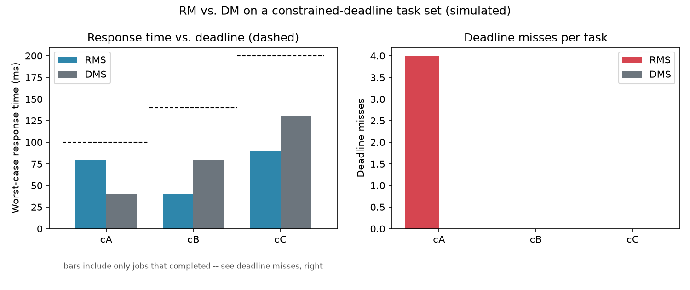

# edf-vs-dm-rtos

A comparison of four real-time scheduling policies — Rate-Monotonic (RMS), Deadline-Monotonic
(DMS), naive Earliest-Deadline-First (EDF), and efficient EDF — running on an Arduino Mega 2560
under FreeRTOS, built on Robin Kase's [ESFree](https://github.com/RobinK2/ESFree) scheduler
library.

## Verification status

| Claim | Status |
|---|---|
| All four configurations (RMS, DMS, naive EDF, efficient EDF) compile and link for the ATmega2560 | ✅ Machine-verified — `pio run -e rms\|dms\|edf_naive\|edf_efficient`, CI runs this on every push |
| Priority assignment, deadline-miss detection, tick-wraparound handling, TCB array bookkeeping are logically correct | ✅ Host-tested against the real compiled scheduler source (not a reimplementation) — `pio test -e native`, see `host/` |
| RM vs. DM produce different priority orders and different outcomes on a constrained-deadline task set | ✅ Reproducible simulation — see [Result](#one-reproducible-result-simulated) below |
| The scheduler's actual runtime behavior on hardware (trace-macro wiring firing, real timing, efficient-EDF preemption) | ⬜ **Not yet re-verified since this fix pass.** No board was available while making these changes (see `Code/README.md`'s hook-verification checklist for what to check first) |

The `Plots/`, `Reports/`, and `Test Results/` directories, and the archived `.rar`, are kept as
**historical artifacts** from before this fix pass. Several of the bugs below (see
[What was wrong](#what-was-wrong-and-what-changed)) would have affected whatever configuration
produced them, and which exact firmware revision that was is not established — they're not
re-captioned as current results.

## Hardware & architecture

- **Board:** Arduino Mega 2560 (ATmega2560, 16 MHz, 8 KB SRAM).
- **Kernel:** FreeRTOS V10.4.3, via `feilipu/Arduino_FreeRTOS_Library` pinned at tag `10.4.3-8`.
- **Scheduler:** `Code/scheduler.h` / `Code/scheduler-final.cpp` — ESFree's periodic-task
  wrapper, timing-error detection, and all four scheduling policies. See
  [Attribution](#attribution) for exactly what's ESFree's and what's this project's.
- **Policy/config selection:** `Code/schedPolicy.h` — one small header, included by both
  `FreeRTOSConfig.h` and `scheduler.h`, so `configMAX_PRIORITIES` and the efficient-EDF trace
  macros are sized/wired from the same policy choice instead of drifting out of sync.
- **Task sets:** `tasksets/*.json` — the single source of truth for both the firmware's task
  creation calls and the host-side simulator/plotter (see [Task sets](#task-sets)).
- **Measurement:** a bounded in-RAM trace-event ring buffer
  (`{tick, task, event, value}` — release/completion/deadline-miss/overrun), dumped as CSV at
  end-of-run. The same CSV schema is produced by the host simulator, so one plotting script
  handles either a simulated or a hardware-collected trace.

## Attribution & contribution

**Upstream — [ESFree V1.0](https://github.com/RobinK2/ESFree)** (Robin Kase, 2016, GPLv2 with a
linking exception — full text in `LICENSE-ESFree.txt`): the RMS, DMS, naive-EDF, and
efficient-EDF scheduling algorithms themselves, the periodic-task/TCB model, and
timing-error detection (deadline-miss and execution-budget-overrun handling). None of that was
written from scratch here.

**This project — adapted and evaluated ESFree's scheduling policies on an ATmega2560:**
- Ported the library to the Arduino/AVR toolchain and an ATmega2560-sized configuration.
- Added the metrics/instrumentation layer (response-time, CPU-execution-time, overrun, and
  deadline-miss tracking; the trace-event buffer) and the calibrated CPU-bound workload.
- Fixed the correctness bugs listed below, added the `schedPolicy.h` shared-config
  restructuring, the PlatformIO build (four-policy compile matrix + host-native unit tests),
  the host-side simulator, and this packaging.
- Ran the evaluation and produced the historical report/screenshots referenced above.

## What was wrong, and what changed

A prior review of the published `Code/` files (not yet on hardware) found the following.
Each is now fixed and, where the fix is checkable without a board, covered by a test.

1. **DM policy didn't actually run.** The header defined `schedSCHEDULING_POLICY_DM`; the
   implementation tested `schedSCHEDULING_POLICY_DMS` (undefined, so always false) — selecting
   DM silently fell back to whatever raw priority was passed to task creation. Renamed
   consistently to `DMS` (matching upstream). Separately, `schedEDF_EFFICIENT` used to be
   defined unconditionally (not scoped to `schedSCHEDULING_POLICY_EDF`), which made two EDF-only
   code paths compile into the RMS/DMS build and fail — moved into `schedPolicy.h`, scoped
   inside the EDF check, matching upstream. All four configurations now build in CI.
2. **Priority assignment underflowed.** With `configMAX_PRIORITIES` fixed at 4 and 4 periodic
   tasks, RM/DM/naive-EDF priority assignment ran out of levels and assigned one task priority
   `-1`, which wraps to a huge unsigned value passed straight into `xTaskCreate`.
   `configMAX_PRIORITIES` is now sized from the active policy and task count (`schedPolicy.h`),
   per upstream ESFree's own documented rule, with a real assertion instead of a no-op one.
3. **FreeRTOS integration was incomplete.** `configNUM_THREAD_LOCAL_STORAGE_POINTERS` was never
   set (defaults to 0 — the TLS slot this scheduler depends on didn't exist, so writes to it were
   out-of-bounds), and efficient EDF's trace-macro wiring was undocumented and unset. Both are
   now explicit in `FreeRTOSConfig.h`, with the exact macro wiring verified against this
   project's pinned kernel version (not just upstream's older reference).
4. **Metrics measured the wrong things.** A single field was used as both an overrun counter and
   a max-duration tracker; "response time" measured a switch-in-to-switch-out interval, not
   release-to-completion; a deadline miss could be double-counted if ever fully wired up. Each
   metric now has its own field, written from exactly one place — see the table below.
5. **Workloads didn't consume CPU time.** Tasks mostly printed to Serial at 9600 baud; passing
   an execution-budget argument to task creation sets the budget the scheduler enforces, it
   doesn't make the task consume that much CPU time. Replaced with calibrated computation.
   Every task in the original set also had `deadline == period`, so it couldn't demonstrate RM
   and DM choosing different priority orders — added a constrained-deadline task set that does
   (see [Result](#one-reproducible-result-simulated)).
6. **`xTCBArray[pdTRUE == xIndex]`** indexed with the boolean result of a comparison (0 or 1)
   instead of the intended index — fixed, with a regression test.

### Metrics — what each one actually means

| Metric | Definition | Written from |
|---|---|---|
| Response time | Job completion time − release time | `prvPeriodicTaskCode`, once per completed job |
| CPU execution time | Ticks actually running (excludes preemption/blocking) | `vApplicationTickHook`, tick-by-tick |
| Execution-budget overrun | Job exceeded its configured execution budget | `prvExecTimeExceedHook` |
| Deadline miss | Job didn't finish by its absolute deadline | `prvDeadlineMissedHook` |

## Task sets

| Set | Tasks | Deadline vs. period | Purpose |
|---|---|---|---|
| `tasksets/implicit_deadline.json` (`SCHED_TASKSET=0`, default) | 4 | deadline == period | Original task set, kept as-is |
| `tasksets/constrained_deadline.json` (`SCHED_TASKSET=1`) | 3 | deadline < period, deadline order ≠ period order | Only this set can show RM and DM disagree — see below |

## One reproducible result (simulated)

No board was available while making these changes, so this result comes from
`host/sim/simulate.py` — a millisecond-resolution fixed-priority simulator that assigns
priorities exactly the way `prvSetFixedPriorities()` does and runs each task's declared budget
as its execution time. It is **not** a hardware timing measurement; it exists because it's the
one result that's honestly reproducible right now, and it uses the same task-set files and
trace-CSV schema the firmware itself uses, so the same plotting script will work once real
hardware traces are collected.

On the constrained-deadline task set, task `cA` has the *shortest deadline but the longest
period* — RM ranks it lowest priority (by period), DM ranks it highest (by deadline):



Under RM, `cA` misses its deadline 4 times in two hyperperiods; under DM, nothing misses.
Reproduce it:

```
python3 host/sim/simulate.py tasksets/constrained_deadline.json rms > results/trace_rms.csv
python3 host/sim/simulate.py tasksets/constrained_deadline.json dms > results/trace_dms.csv
python3 host/sim/plot_results.py results/trace_rms.csv rms results/trace_dms.csv dms \
    --deadlines tasksets/constrained_deadline.json \
    --out results/rm_vs_dm_constrained_deadline.png
```

## Build / run

**On hardware (Arduino IDE):** see `Code/README.md` — library version, the config-file copy
step, and how to pick a policy/task-set.

**Compile-verify without hardware (PlatformIO):**
```
pip install platformio
pio run -e rms            # or dms, edf_naive, edf_efficient
pio run -e dms_constrained # constrained-deadline task set
```

**Host-side unit tests (no board, tests the real compiled scheduler logic):**
```
pio test -e native
```
See `host/fakes/README.md` for exactly what is and isn't covered this way.

**CI:** `.github/workflows/build.yml` runs all of the above on every push.

## Repository layout

```
Code/                   firmware (Arduino IDE sketch + ESFree-derived scheduler)
schedPolicy.h            shared policy/config selection (Code/)
tasksets/               machine-readable task-set definitions
host/fakes/             minimal FreeRTOS stand-ins for host-native builds
host/test/              Unity tests against the real scheduler source
host/sim/               simulator + plotting script (this README's reproducible result)
results/                simulator output (trace CSVs, plot)
platformio.ini          AVR compile matrix + native test env
.github/workflows/      CI
LICENSE-ESFree.txt       upstream ESFree license (GPLv2 + linking exception)
Plots/, Reports/,
Test Results/,
*.rar, videoDemo.mp4     historical artifacts, predate this fix pass (see Verification status)
```
